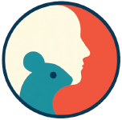

# BehaveAgent v1.0




*Autonomous AI agent for universal behavior analysis (BehaveAgent v1.0).*

BehaveAgent automates behavior analysis from video without manual intervention, leveraging multimodal AI to generalize across species and experimental paradigms. It integrates LLMs, vision-language models, and visual grounding to perform tracking, temporal action detection, and behavior segmentation. BehaveAgent autonomously detects behavioral tasks and paradigms, selects appropriate analysis strategies, generates code for custom analyses, and produces comprehensive reports, introducing a new way of behavior analysis.

## Code Avalibility
We are finalizing the code for end users, focusing on accessibility and ease of setup. Stay tuned – it’s coming soon!

## Features

1. **Fully Autonomous Analysis:** End-to-end behavior analysis from video without manual intervention.
2. **Multimodal AI Integration:** Combines LLMs, vision-language models, and visual grounding for robust, context-aware analysis.
3. **Zero-Shot Generalization:** Analyzes novel species and experimental paradigms without additional fine-tunning.
4. **Adaptive Strategy Selection:** Automatically identifies the correct analysis approach for diverse tasks.
5. **Core Data Outputs:** Extracts critical behavioral data, including feature positions as coordinates, temporal action segmentation, and precise tracking.
6. **Autonomous Code Generation:** Dynamically generates and executes code for specialized analyses.
7. **Interpretable Reasoning:** Provides transparent explanations for behavior identification and feature tracking.
8. **Integrated Reporting:** Automatically generates scientific reports with context-specific insights.
9. **Interactive Analysis:** Supports real-time, human-in-the-loop exploration, adjustment, and visualization of tracked data.


## Project Structure (Overview)

```
├── main_gui.py             # Main Streamlit frontend script
├── behave_ai.py            # Core BehaviorAgent class
├── interactive_mode.py     # Switching from autonomous AI to Human-AI collaboration
├── tools/                  # Directory containing analysis tool modules
│   ├── identifying_experiment.py
│   ├── evaluating_behavior_resolution.py
│   ├── feature_tracking.py
│   ├── behavior_segmentation.py
│   ├── object_segment.py
│   ├── sam2_tool.py   
│   ├── report.py
│   ├── filter.py             
│   ├── python_repl_tool.py   
│   ├── __init__.py
│   └── memory/               
│       └── context_information
│       └── report
│       └── produced_data
├── requirements.txt        # Python dependencies
├── config.env              # API keys and configuration 
├── README.md               # This file
```

